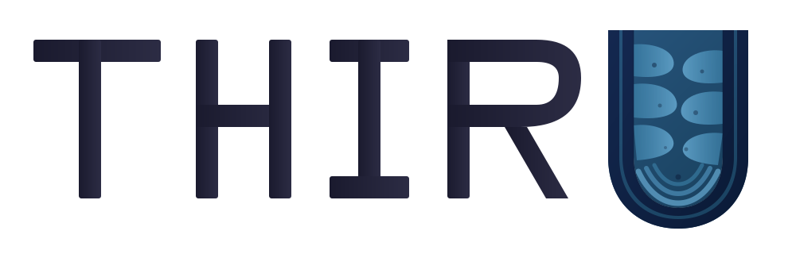

# THIRU — TEM Histological Image Recognition for Ultrastructure

<p align="center">
  
</p>

A web application for automated segmentation of ultrastructural features in retinal transmission electron microscopy (TEM) images. Built on [SynapseNet](https://github.com/computational-cell-analytics/synapse-net) UNet2d models fine-tuned on retinal synaptic tissue.

## Features

- **Synaptic Vesicle Detection** — Identifies and counts individual synaptic vesicles
- **Mitochondria Segmentation** — Delineates mitochondrial boundaries
- **Presynaptic Membrane Segmentation** — Maps presynaptic membrane regions
- **Tiled Inference** — Handles arbitrarily large EM images via overlapping tile prediction
- **Interactive Threshold** — Adjustable prediction threshold for sensitivity/specificity trade-off
- **Downloadable Results** — Overlay images and binary masks (TIFF) for downstream analysis

## Architecture

- **Model**: UNet2d (depth=4, 32 initial features) trained with FocalDiceLoss
- **Inference**: 256x256 tiles with 32px overlap, sigmoid activation, weighted averaging
- **Post-processing**: Morphological opening, connected component analysis, area filtering
- **Frontend**: Gradio 6.x with custom styling and password authentication
- **Deployment**: GPU-accelerated (NVIDIA RTX 3070), served via Cloudflare tunnel

## Supported Input Formats

- TIFF / TIF (including 16-bit and multi-page)
- PNG
- JPEG

## Deployment

```bash
# Clone and install dependencies
git clone https://github.com/Chuter-lab/SynapseNet-Retina-Webapp.git
cd SynapseNet-Retina-Webapp
pip install -r requirements.txt

# Place model checkpoints in the configured models directory
# (see config.py for paths)

# Launch
python app.py
```

See `DEPLOY_LOCAL.txt` for server-specific deployment instructions.

## Project Structure

```
├── app.py              # Gradio application and UI
├── config.py           # Paths, model params, app settings
├── inference.py        # Tiled UNet2d inference engine
├── visualization.py    # Overlay and panel rendering
├── unet.py             # Vendored UNet2d model (from torch_em)
├── requirements.txt    # Python dependencies
├── static/
│   ├── thiru_logo.svg  # THIRU logo (source)
│   ├── favicon.svg     # Favicon (U mitochondria)
│   ├── favicon.ico     # Multi-size favicon
│   └── favicon.png     # 256px favicon PNG
└── DEPLOY_LOCAL.txt    # Server deployment guide (gitignored)
```

## Lead Developer

Benton Chuter, MD, MS
